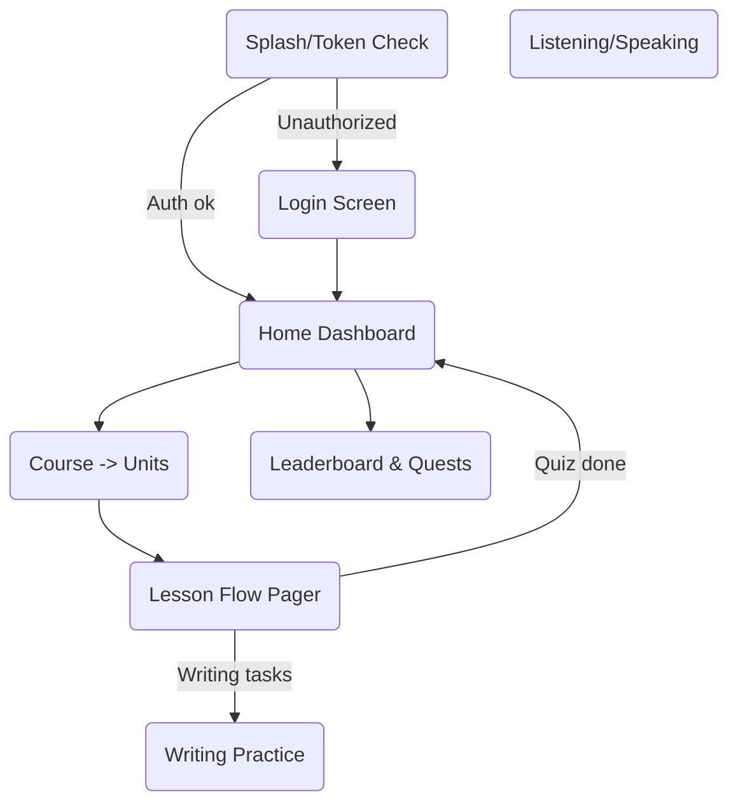
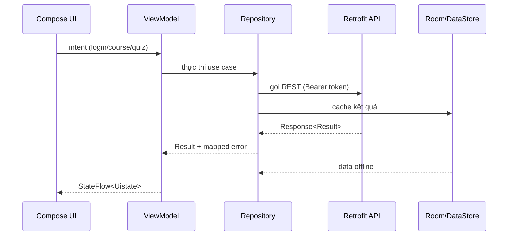
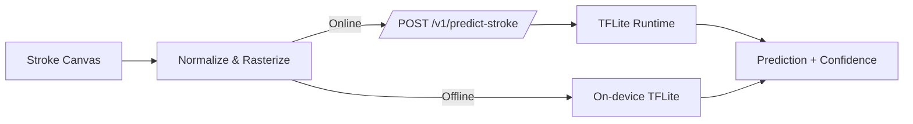

# Báo cáo kiến trúc Android app `seoulhankukobook`

```mermaid
flowchart LR
    subgraph Presentation
        Screens[Compose Screens]
        Components[Reusable Components]
        Navigation[Navigation Graph]
    end
    subgraph ViewModel
        VM[Hilt ViewModel]
        StateFlow[StateFlow + UIState]
    end
    subgraph Domain
        UseCase[Use Cases]
        Models[Domain Models]
    end
    subgraph Data
        Repo[Repositories]
        Remote[Retrofit API]
        Local[Room + DataStore]
        Mapper[ExceptionMapper]
    end

    Screens --> VM --> UseCase --> Repo
    Repo --> Remote
    Repo --> Local
    Repo -->|ML| MLPredictor[TFLite (optional)]
```

---

## Luồng điều hướng chính



- `LoginScreen` quan sát `AuthViewModel.authState`.
- `ModernHomeScreen` lấy courses/streak từ `HomeViewModel`.
- `LessonFlowScreen` điều phối pager quiz, XP, TTS.

---

## Luồng dữ liệu & API



- `AuthInterceptor` tự đính token & refresh khi 401.
- Mọi repository trả `Result<T>` kèm lỗi domain (`AppException`).

---

## Inference nét chữ



- Mặc định: gọi backend qua `MLPredictionRepository`.
- Định hướng offline:
  - Hilt cung cấp `Interpreter`.
  - `LocalStrokePredictor` → `PredictCharacterUseCase`.
  - Chiến lược hybrid: ưu tiên on-device, fallback API.

---

## Checklist cải tiến

- [ ] Hoàn thiện module on-device TFLite + asset pipeline.
- [ ] Chuẩn hóa UI state (Loading/Error) với `sealed class`.
- [ ] Bổ sung test UI Compose và integration repository.
- [ ] Đồng bộ analytics (streak, XP) vào dashboard.

