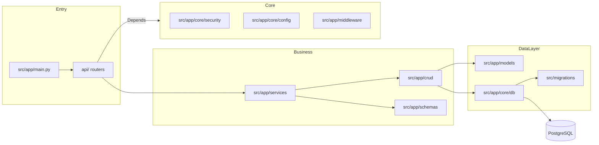
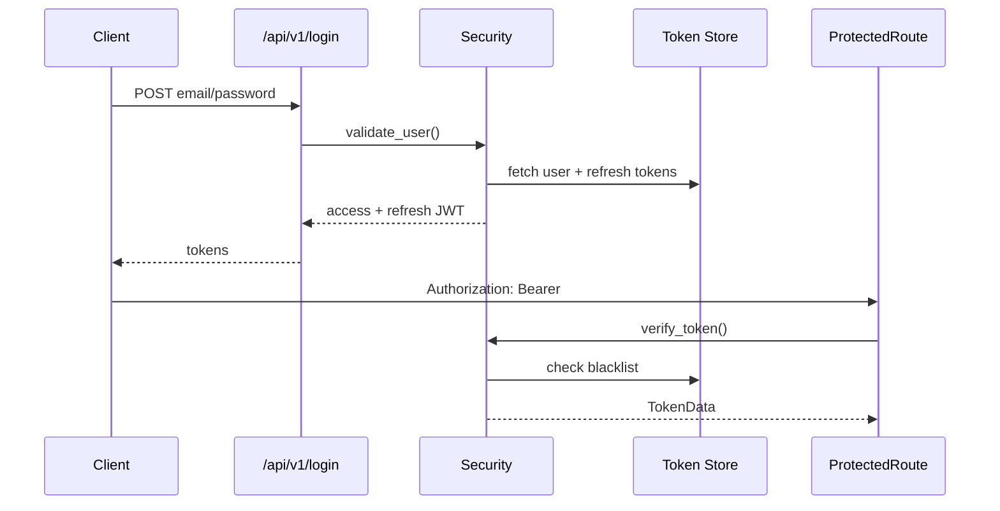

# Báo cáo Backend API



---

## Nhóm API chính

| Domain            | Endpoint tiêu biểu            | Ghi chú ngắn |
|-------------------|-------------------------------|--------------|
| Auth & Users      | `/api/v1/login`, `/logout`, `/users`, `/google-auth` | JWT + refresh rotation |
| Courses & Lessons | `/api/v1/courses`, `/units`, `/lessons`, `/exercises` | Nội dung học + tiến độ |
| Progress & Rewards| `/api/v1/user-progress`, `/daily-goals`, `/badges`, `/leaderboard` | Gamification, streak |
| Entry & AI        | `/api/v1/entry-test`, `/api/v1/predict/stroke`, `/api/stroke/analyze` | Placement & handwriting AI |
| Social & Notify   | `/api/v1/friends`, `/user-notifications` | Bạn bè, thông báo |
| Ops & System      | `/api/v1/tasks`, `/rate-limits`, `/tiers`, `/api/answers` | Quản trị, giới hạn, FAQ |

---

## Luồng Auth & Token



- `access_token` 15 phút, `refresh_token` lưu DB + rotate.
- Token blacklist kiểm tra tại `crud_token_blacklist`.

---

## Luồng AI handwriting

```mermaid
flowchart LR
    Request[/POST /api/v1/predict/stroke/]
    Validate[Schema validate\n(Pydantic)]
    Preprocess[StrokePreprocessor\n-> 28x28 tensor]
    ModelLoader[get_model()]
    TFLite[tflite-runtime / TF]
    Response[PredictStrokeResponse]

    Request --> Validate --> Preprocess --> ModelLoader --> TFLite --> Response
    ModelLoader -->|fallback| MockPredictor
```

- Kết quả trả về: ký tự dự đoán, confidence, top-k.
- Log inference vào bảng `ai_log` (qua service).

---

## CSDL & Migration

```mermaid
flowchart TB
    Alembic[srс/migrations/env.py]
    Models[src/app/models/*.py]
    Engine[async_engine\n(asyncpg)]
    Session[async_sessionmaker]
    Repo[crud/*]

    Models --> Alembic
    Engine --> Session --> Repo
    Repo --> PostgreSQL[(DB)]
```

- Base ORM: `DeclarativeBase + MappedAsDataclass`.
- Migration chạy offline/online, auto import model.

---

## Checklist vận hành

- [ ] Hoàn thiện contract schema cho `/api/stroke/analyze` và `/api/v1/predict/stroke`.
- [ ] Thêm test integration cho course pagination + role-based access.
- [ ] Theo dõi rate limit via `rate_limit.py` và expose metrics Prometheus.
- [ ] Tự động hoá deploy Alembic trong pipeline CI/CD.


