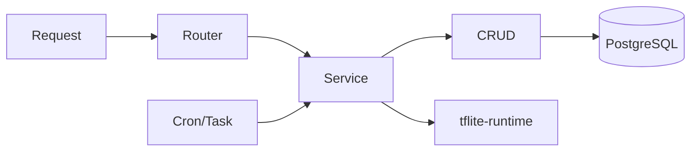
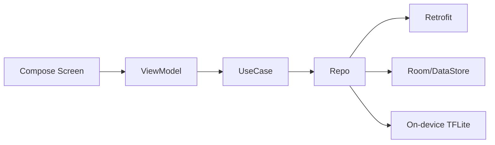
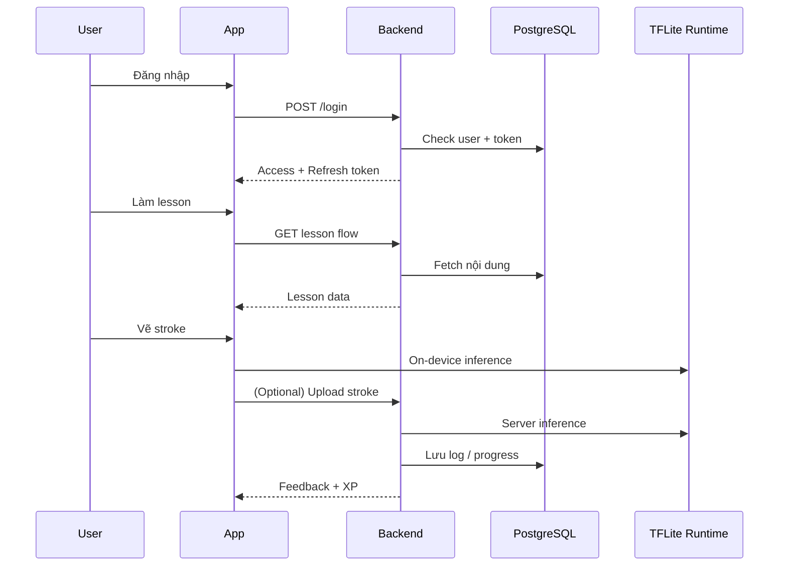
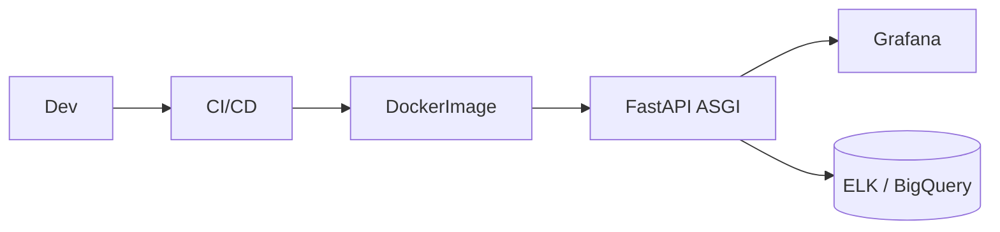

## Kiến Trúc Tổng Quan

```mermaid
flowchart TB
    subgraph Client[Android App]
        UI[Compose Screens]
        VM[ViewModel + UseCase]
        Repo[Repository + Room/DataStore]
        UI --> VM --> Repo
        Repo --> TFLite[TensorFlow Lite (on-device)]
    end

    subgraph Cloud[FastAPI Backend]
        API[REST API Layer]
        Service[Service / ML Gateway]
        DBLayer[SQLAlchemy + Alembic]
        API --> Service --> DBLayer
        Service --> TFLiteSrv[TFLite Runtime]
    end

    subgraph Data[PostgreSQL & Storage]
        PG[(PostgreSQL)]
        Logs[(AI Logs)]
    end

    Client -- HTTPS + OAuth2/JWT --> Cloud
    Cloud --> PG
    Cloud --> Logs
```

- Android xử lý UI, trạng thái, cache, inference nhanh bằng `.tflite`.
- FastAPI nhận request, xác thực, điều phối nghiệp vụ, chạy inference nâng cao.
- PostgreSQL lưu user/course/progress, log AI phục vụ phân tích & re-train.

---

## Backend Stack (FastAPI)

- `api/`: controller theo domain (`auth`, `course`, `stroke`...).
- `services/`: nghiệp vụ & gateway ML (`stroke_analyzer.py`).
- `ml/`: nạp model, preprocess, util inference.
- `core/`: config, security OAuth2/JWT, middleware, DI.
- `models/`, `schemas/`: ORM + Pydantic song song.
- `worker/`, `scripts/`: background jobs, CLI bổ trợ.



---

## Android Stack (Jetpack Compose)

- `presentation/`: Compose screen, component, navigation.
- `viewmodel/`: Hilt inject repository + use case.
- `domain/`: use case, model thuần Kotlin, validator.
- `data/`: Retrofit API, Room, DataStore, repository hợp nhất.
- `ml/` & `ui/screen/canvas`: xử lý nét vẽ, inference on-device.



---

## Luồng Nghiệp Vụ Chính



- Token hết hạn → interceptor tự refresh (`/login/refresh`).
- Nội dung đồng bộ định kỳ, ưu tiên cache Room.
- Gamification: điểm, badge, leaderboard đều qua API `/gamification/*`.

---

## Giám Sát & Vận Hành

- Dashboard Grafana: latency API, accuracy AI, số phiên học.
- Log tập trung (`/var/log/ai-service/`, bảng `ai_log`).
- Script CLI: seed dữ liệu, migrate, quản trị viên.
- Triển khai: Docker + Compose/Render, lưu cấu hình trong repo.



