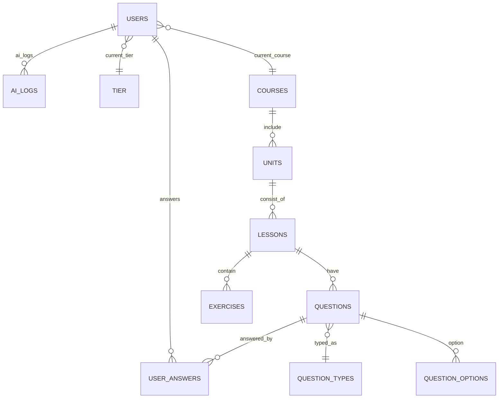
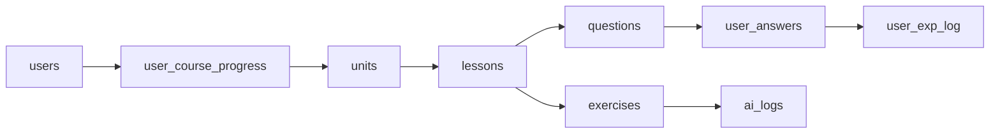
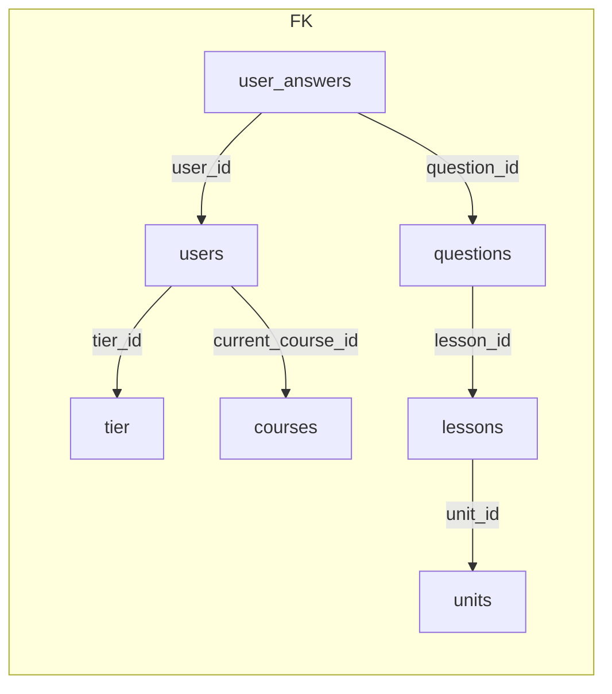

# Database Schema Report



- Tất cả bảng chính dùng `UUID` + `gen_random_uuid()`.
- Cascade delete cho quan hệ `lesson -> question`, `user -> user_answer`.

---

## Dòng dữ liệu học viên



- `user_course_progress`, `user_unit_progress`, `user_lesson_progress` giữ trạng thái.
- `ai_logs` lưu kết quả chấm điểm từ dịch vụ AI.

---

## Nhóm bảng chính

| Domain         | Bảng then chốt                  | Ghi chú ngắn |
|----------------|----------------------------------|--------------|
| Nhận diện user | `users`, `tier`, `user_preferences` | JWT, phân hạng |
| Nội dung học   | `courses`, `units`, `lessons`    | Thứ tự `order_index` |
| Câu hỏi/quiz   | `question_types`, `questions`, `question_options`, `question_matching_pairs` | Cấu trúc đa hình |
| Tracking       | `user_answers`, `user_exp_log`, `daily_goals` | JSONB cho đáp án |
| AI & log       | `ai_logs`, `ml_model_version`    | Theo dõi inference |

---

## Tối thiểu cần nhớ về khóa

- `users.tier_id → tier.id`
- `lessons.unit_id → units.id`
- `questions.lesson_id → lessons.id`
- `user_answers.question_id → questions.id`
- `ai_logs.user_id → users.id`



---

## Mẫu CREATE TABLE rút gọn

```sql
CREATE TABLE users (
    id UUID PRIMARY KEY DEFAULT gen_random_uuid(),
    username VARCHAR(50) UNIQUE NOT NULL,
    email VARCHAR(100) UNIQUE NOT NULL,
    password VARCHAR(255) NOT NULL,
    tier_id UUID REFERENCES tier(id),
    current_course_id UUID REFERENCES courses(id),
    exp INTEGER DEFAULT 0,
    streak_days INTEGER DEFAULT 0,
    created_at TIMESTAMPTZ DEFAULT CURRENT_TIMESTAMP
);
```

```sql
CREATE TABLE user_answers (
    id UUID PRIMARY KEY DEFAULT gen_random_uuid(),
    user_id UUID NOT NULL REFERENCES users(id) ON DELETE CASCADE,
    question_id UUID NOT NULL REFERENCES questions(id) ON DELETE CASCADE,
    answer JSONB NOT NULL,
    is_correct BOOLEAN,
    score DOUBLE PRECISION,
    answered_at TIMESTAMPTZ DEFAULT CURRENT_TIMESTAMP
);
```

---

## Checklist schema

- [ ] Đồng bộ `migrations/` với model mới nhất (`alembic revision --autogenerate`).
- [ ] Bổ sung index `GIN` cho cột JSONB truy vấn thường xuyên.
- [ ] Thiết lập `view` cho dashboard (progress/exp) nếu cần truy vấn phức tạp.
- [ ] Sao lưu định kỳ & kiểm tra `pgcrypto` extension cho UUID.

