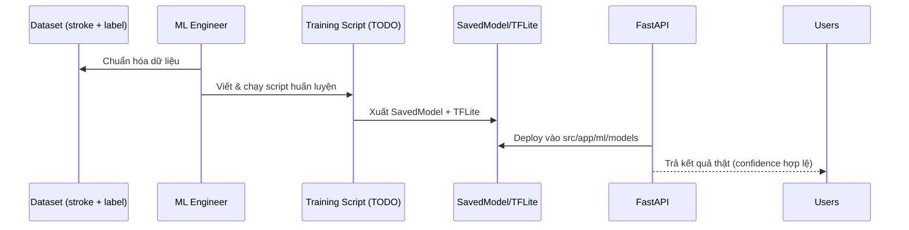

# Hangul Stroke Recognition Model Report

## Trạng thái hiện tại

- **Chưa có mô hình huấn luyện thực tế** trong repo. Thư mục `src/app/ml/models/hangul_cnn_model/` trống; dự án chạy bằng **mock model** tạo qua `_create_mock_model()` khi tải model thất bại.
- **Không có log huấn luyện**, metric, hay file `.tflite` đính kèm. Mục “Training Model” trong `src/app/ml/README.md` vẫn để TODO.
- Backend API `/api/v1/predict/stroke` và service `StrokeAnalyzer` hoạt động được nhờ mock: dự đoán ngẫu nhiên với 10 lớp placeholder thay vì bộ ký tự Hangul đầy đủ.

```mermaid
flowchart LR
    Request[/POST /api/v1/predict/stroke/]
    Preprocess[StrokePreprocessor\n→ 28x28 image]
    Loader[model_loader.load_model()]
    Mock[Mock TF model\n(Dense 10 classes)]
    Response[Predicted char (mock)]

    Request --> Preprocess --> Loader --> Mock --> Response
    Loader -.->|fallback| Mock
```

---

## Artifacts & cấu hình

| Hạng mục                | Trạng thái | Ghi chú |
|-------------------------|-----------|--------|
| SavedModel (`hangul_cnn_model/`) | ❌ | Chưa tồn tại trong repo |
| TFLite (`hangul_stroke_model.tflite`) | ❌ | Chưa build |
| Script huấn luyện (`train_hangul_cnn.py`) | ❌ | Chưa có, được đề cập TODO |
| Log huấn luyện (TensorBoard/MLflow) | ❌ | Không tìm thấy |
| Mock model loader | ✅ | `_create_mock_model()` trả về CNN tối giản (Dense 10 lớp) |

---

## Yêu cầu để có mô hình thật



- Cần thu thập dataset stroke + nhãn chuẩn, mô tả rõ trong tài liệu.
- Thiết kế kiến trúc CNN/Transformer phù hợp 96 ký tự Hangul, log metric (accuracy, F1).
- Tích hợp pipeline convert → TFLite (nếu cần chạy on-device/back-end).

---

## Việc cần làm

- [ ] Thu thập & ghi lại metadata dataset (nguồn, kích thước, phân chia train/val/test).
- [ ] Hoàn thiện script huấn luyện + hướng dẫn tái lập (`docs/ml_training`).
- [ ] Huấn luyện mô hình thật, lưu SavedModel + `.tflite`, cập nhật config loader.
- [ ] Cập nhật API để trả danh sách ký tự đúng (96 lớp) với top-k hợp lệ.
- [ ] Viết test regression cho inference (mock vs real) và log metric định kỳ.

